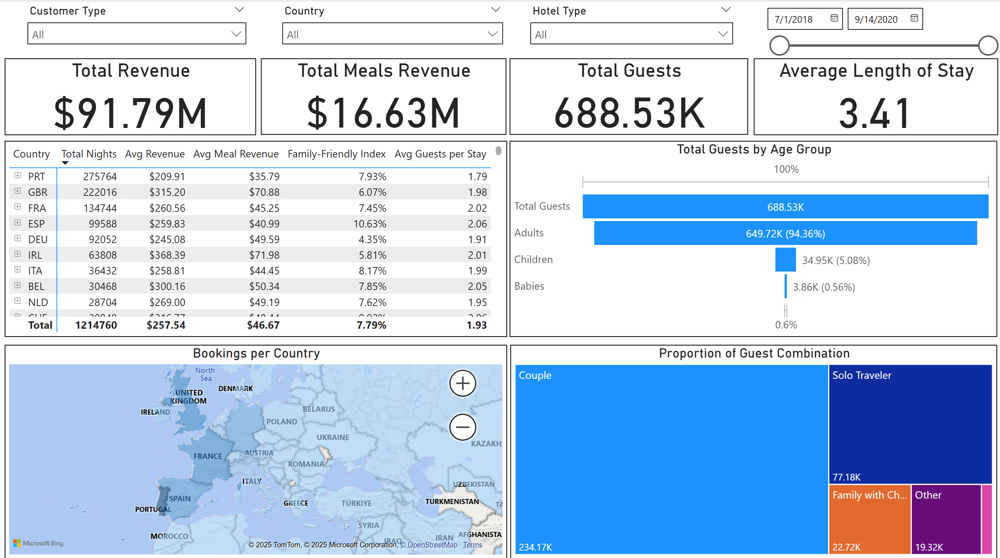

# Hotel Revenue
To repozytorium GitHub służy do przechowywania dashboardów Hotel Revenue stworzonych w Power BI. Projekt bazuje na [zbiorze danych Hotel Revenue](https://www.kaggle.com/datasets/govindkrishnadas/hotel-revenue). Statyczny eksport dashboardów w formacie PDF jest dostępny [tutaj](./Hotel%20Revenue%20Dashboards.pdf). Należy pamiętać, że wersja PDF nie obsługuje elementów interaktywnych.

English version of the document can be [found here](README.md)/Angielską wersję dokumentu można [znaleźć tutaj](README.md).

## Zawartość
* [Summary Dashboard](#summary-dashboard)
* [Meals & Special Requests](#meals--special-requests)
* [Demography](#demography)
* [Marketing & Operations](#marketing--operations)
* [Import danych](#import-danych)
* [Formuły DAX: miary i kolumny](#formuły-dax-miary-i-kolumny)

### Summary Dashboard


Dashboard podsumowujący kluczowe wskaźniki finansowe hoteli. Zawiera analizę przychodów według typu hotelu (miastowy vs. wypoczynkowy) z wykorzystaniem wykresu donutowego, przedział czasowy (2018–2020) z możliwością filtrowania po datach, oraz szczegóły dotyczące rabatów i zajętości miejsc parkingowych. Dodatkowo, tabela z danymi rocznymi umożliwia głębszą analizę trendów przychodów i powiązanych metryk.

Szczegóły dotyczące miar DAX i kolumn obliczeniowych użytych w tym dashboardzie znajdują się w sekcji [Formuły DAX: miary i kolumny](#summary-dashboard-1).

### Meals & Special Requests


Dashboard 'Meals & Special Requests' koncentruje się na analizie przychodów z posiłków oraz specjalnych próśb gości hotelowych. Prezentuje kluczowe metryki, takie jak całkowity przychód z posiłków i średni przychód na pobyt. Zawiera tabelę z danymi rocznymi (2018–2021) oraz podział przychodów według typu posiłku (np. Bed & Breakfast, Full Board). Dodatkowo, wizualizacje osi czasu pozwalają śledzić trendy przychodów i próśb w wybranych okresach (np. 2019–2020).

Szczegóły dotyczące miar DAX i kolumn obliczeniowych użytych w tym dashboardzie znajdują się w sekcji [Formuły DAX: miary i kolumny](#meals--special-requests-1).

### Demography


Dashboard "Demography" to narzędzie analityczne przedstawiające szczegółową demografię gości hotelowych. Na interaktywnej mapie geograficznej, wzbogaconej rozbudowanymi tooltipami, prezentowane są kluczowe wskaźniki takie jak całkowity przychód z rezerwacji (total bookings revenue), liczba gości czy średnia długość pobytu. Dashboard zawiera również analizę grup wiekowych oraz inteligentną klasyfikację typów podróżujących (solo, para, rodzina) opartą na zaawansowanych miarach DAX. Rozwiązanie pozwala na wielowymiarową analizę danych z możliwością szybkiego przełączania między różnymi perspektywami.

Szczegóły dotyczące miar DAX i kolumn obliczeniowych użytych w tym dashboardzie znajdują się w sekcji [Formuły DAX: miary i kolumny](#demography-1).

### Marketing & Operations


Dashboard "Marketing & Operations" koncentruje się na analizie efektywności strategii marketingowych oraz procesów operacyjnych hotelu. Bada kluczowe wskaźniki, takie jak wskaźnik bezpośrednich rezerwacji (direct booking rate) czy odsetek powracających gości (returning guests rate), aby ocenić lojalność klientów i skuteczność kampanii. W zakresie operacji, dashboard analizuje czas wyprzedzenia rezerwacji (lead time) za pomocą niestandardowego histogramu, stworzonego poprzez modyfikację wykresu kolumnowego w Power BI – co pozwala na identyfikację wzorców planowania pobytów przez gości. Narzędzie łączy w sobie dane o segmentacji rynku, typach klientów i trendach czasowych, umożliwiając holistyczną optymalizację działań biznesowych.

Szczegóły dotyczące miar DAX i kolumn obliczeniowych użytych w tym dashboardzie znajdują się w sekcji [Formuły DAX: miary i kolumny](#marketing--operations-1).

### Import danych
Dane zostały załadowane do **Power BI** bezpośrednio z serwera **SQL Server** wykorzystując poniższe zapytanie SQL:
```WITH hotels AS (
SELECT * FROM dbo.[2018$]
UNION ALL
SELECT * FROM dbo.[2019$]
UNION ALL
SELECT * FROM dbo.[2020$])

SELECT * 
FROM hotels
LEFT JOIN dbo.market_segment$
ON hotels.market_segment = market_segment$.market_segment
LEFT JOIN dbo.meal_cost$
ON meal_cost$.meal = hotels.meal
WHERE is_canceled = 0
```

To query łączy dane o rezerwacjach hotelowych z trzech kolejnych lat (2018-2020) przy użyciu operatora UNION ALL. Następnie wzbogaca je o dodatkowe informacje poprzez:

1. LEFT JOIN z tabelą market_segment$ - aby dodać szczegóły dotyczące segmentu rynkowego
2. LEFT JOIN z tabelą meal_cost$ - aby dołączyć dane o kosztach posiłków

Kluczowy element to filtrowanie wyników (WHERE is_canceled = 0), które:
- Wyklucza anulowane rezerwacje (gdzie is_canceled = 1)
- Pozostawia tylko zrealizowane pobyty (gdzie is_canceled = 0)
- Gwarantuje, że analiza przychodów opiera się na faktycznie wykonanych usługach

### Formuły DAX: miary i kolumny
#### **Summary Dashboard**
* **Revenue Column**

```=([stays_in_week_nights]+[stays_in_weekend_nights])*([adr]-([adr]*[Discount]))```

Ta miara DAX oblicza całkowity przychód z rezerwacji. Ponieważ zbiór danych nie zawierał bezpośrednich informacji o przychodach, a jedynie Średnią Dzienną Stawkę (ADR), formuła oblicza przychód poprzez:

1. Obliczenie łącznego czasu pobytu (noclegi w tygodniu + weekendy)
2. Dostosowanie ADR poprzez zastosowanie obowiązujących zniżek
3. Pomnożenie skorygowanego ADR przez łączną liczbę noclegów

Kluczowe składniki:

1. stays_in_week_nights: Liczba zarezerwowanych nocy w dniach roboczych
2. stays_in_weekend_nights: Liczba zarezerwowanych nocy weekendowych
3. adr: Średnia Dzienna Stawka (cena bazowa przed rabatami)
4. Discount: Procentowa zniżka zastosowana do stawki (wyrażona jako ułamek dziesiętny, np. 0.1 dla 10%)

* **Total Nights**

```= SUM(Query1[stays_in_week_nights]) + SUM(Query1[stays_in_weekend_nights])```

Prosta miara DAX obliczająca łączną liczbę noclegów dla wszystkich rezerwacji, sumując:

stays_in_week_nights: noclegi w dniach roboczych (poniedziałek–piątek),

stays_in_weekend_nights: noclegi w weekendy (sobota–niedziela).

* **Parking Space Nights**

```
= SUMX(
    Query1,
    Query1[required_car_parking_spaces] * (Query1[stays_in_week_nights] + Query1[stays_in_weekend_nights]))
```

Ta miara DAX oblicza łączną liczbę noclegów z wymaganym miejscem parkingowym poprzez:

1. Pomnożenie liczby wymaganych miejsc parkingowych (required_car_parking_spaces) dla każdej rezerwacji
2. Przez łączną długość pobytu (suma nocy weekday i weekendowych)

Zastosowanie:

1. Określa całkowite zapotrzebowanie na miejsca parkingowe
2. Stanowi podstawę do dalszych analiz obciążenia parkingu hotelowego
3. Może posłużyć do wyliczenia wskaźnika obłożenia miejsc parkingowych (w połączeniu z danymi o rzeczywistej pojemności parkingu)


* **Parking Percentage**

```= [Parking Space Nights] / [Total Nights] ```

Ta miara DAX oblicza procentowy udział noclegów wymagających miejsca parkingowego w stosunku do wszystkich noclegów. W obliczeniach wykorzystujemy wcześniej zdefiniowane miary:

Parking Space Nights - liczba noclegów z deklarowanym zapotrzebowaniem na parking

Total Nights - łączna liczba wszystkich noclegów

*Kontekst:*
Ponieważ dataset nie zawiera informacji o rzeczywistej liczbie miejsc parkingowych w hotelu (brak takich kolumn ani dokumentacji), ta miara stanowi najlepsze dostępne przybliżenie faktycznego zapotrzebowania gości na parking.

Zastosowanie:
1. Śledzenie zmian w zapotrzebowaniu na parking w czasie
2. Analiza sezonowości potrzeb parkingowych
3. Porównanie pomiędzy różnymi segmentami gości

#### **Meals & Special Requests**
* **Effective Daily Cost**

```
= SUMX(
    Query1,
    VAR TotalNights = Query1[stays_in_week_nights] + Query1[stays_in_weekend_nights]
    RETURN
        SWITCH(
            TRUE(),
            Query1[meal] = "Self catering", Query1[Cost],
            Query1[meal] = "Undefined", 0,
            Query1[Cost] * TotalNights
        )
)
 ```

Miara oblicza efektywny przychód z posiłków uwzględniając specyfikę opcji żywieniowych:
1. Dla opcji Self Catering (np. udostępnienie kuchni) – przyjmuje jednorazową płatność (kwota z kolumny [Cost]),
2. Dla opcji Undefined (niezdefiniowane) – przychód wynosi 0,
3. Dla pozostałych opcji (np. Bed & Breakfast) – przychód jest naliczany proporcjonalnie do długości pobytu (koszt dzienny × łączna liczba dni: stays_in_week_nights + stays_in_weekend_nights).

* **Average Meal Cost per Reservation**

```
= AVERAGEX(
    Query1,
    VAR TotalNights = Query1[stays_in_week_nights] + Query1[stays_in_weekend_nights]
    RETURN
        SWITCH(
            TRUE(),
            Query1[meal] = "Self catering", Query1[Cost],
            Query1[meal] = "Undefined", 0,
            Query1[Cost] * TotalNights
        )
) 
```

Miara oblicza średni przychód z posiłków na jedną rezerwację, uwzględniając specyfikę opcji żywieniowych:
1. Dla opcji Self Catering (np. udostępnienie kuchni) – przyjmuje jednorazową płatność (kwota z kolumny [Cost]),
2. Dla opcji Undefined (niezdefiniowane) – przychód wynosi 0,
3. Dla pozostałych planów żywieniowych (np. Bed & Breakfast) – przychód jest proporcjonalny do długości pobytu (koszt dzienny × łączna liczba dni).

Średnia jest liczona dla wszystkich rezerwacji w bieżącym kontekście filtrowania.

#### **Demography**

* **Guest Combination**

```
= VAR Adults = [adults]
VAR Children1 = [children]
VAR Babies = [babies]
RETURN
SWITCH(
TRUE(),
Adults = 1 && Children1 = 0 && Babies = 0, "Solo Traveler",
Adults = 2 && Children1 = 0 && Babies = 0, "Couple",
Adults >= 2 && Children1 > 0, "Family with Children",
Babies > 0, "Family with Baby",
"Other"
) 
```

Kolumna obliczeniowa klasyfikująca rezerwacje na podstawie składu gości:
1. Solo Traveler – 1 dorosły, bez dzieci,
2. Couple – 2 dorosłych, bez dzieci,
3. Family with Children – 2+ dorosłych z dziećmi,
4. Family with Baby – obecność niemowląt,
5. Other – pozostałe kombinacje.

Uwaga: Klasyfikacja odbywa się na podstawie kolumn [adults], [children] i [babies].

* **Family-Friendly Index**
```
= DIVIDE(
    COUNTROWS(FILTER(Query1, Query1[Children] > 0 || Query1[Babies] > 0)),
    COUNTROWS(Query1),
    0
)
```

Miara oblicza odsetek rezerwacji z udziałem dzieci w stosunku do wszystkich rezerwacji:
1. Uwzględnia rezerwacje, gdzie liczba dzieci (Children) lub niemowląt (Babies) jest większa od zera,
2. Wynik przedstawia wartość procentową (np. 0,25 = 25%),
3. Parametr 0 zabezpiecza przed błędami w skrajnych przypadkach (np. pusta tabela po filtrowaniu).

* **Average Length of Stay**
```
= DIVIDE(
    [Total Nights],
    COUNTROWS(Query1),
    0
)
```

Miara oblicza średnią długość pobytu gości poprzez podzielenie łącznej liczby noclegów (Total Nights) przez liczbę rezerwacji.

Total Nights to suma pól stays_in_week_nights i stays_in_weekend_nights,

0 na końcu formuły zabezpiecza przed błędami dzielenia przez zero.

#### **Marketing & Operations**

* **Direct Booking Rate**
```
= DIVIDE(
    COUNTROWS(FILTER(Query1, Query1[distribution_channel] = "Direct")),
    COUNTROWS(Query1),
    0
)
```

Miara oblicza odsetek rezerwacji zrealizowanych bezpośrednio przez hotel (bez pośredników), na podstawie kolumny distribution_channel:
1. Liczy rekordy, gdzie distribution_channel = "Direct",
2. Dzieli przez całkowitą liczbę rezerwacji,
3. Zwraca wartość procentową (np. 0,25 = 25%).

Parametr 0 zabezpiecza przed teoretycznymi błędami w przypadku braku danych.

* **Returning Guests Rate**

```= DIVIDE(COUNTROWS(FILTER(Query1, Query1[is_repeated_guest] = 1)), COUNTROWS(Query1))```

Miara oblicza procent rezerwacji złożonych przez stałych klientów na podstawie kolumny binarnej is_repeated_guest:
1. Zlicza rekordy oznaczone jako 1 (True) - oznaczające gości powracających,
2. Dzieli przez całkowitą liczbę rezerwacji,
3. Wynik przedstawia wartość procentową (np. 0.15 = 15%).